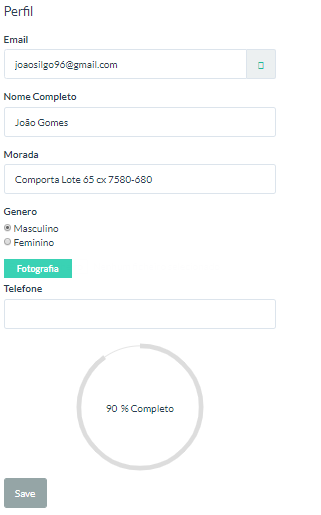
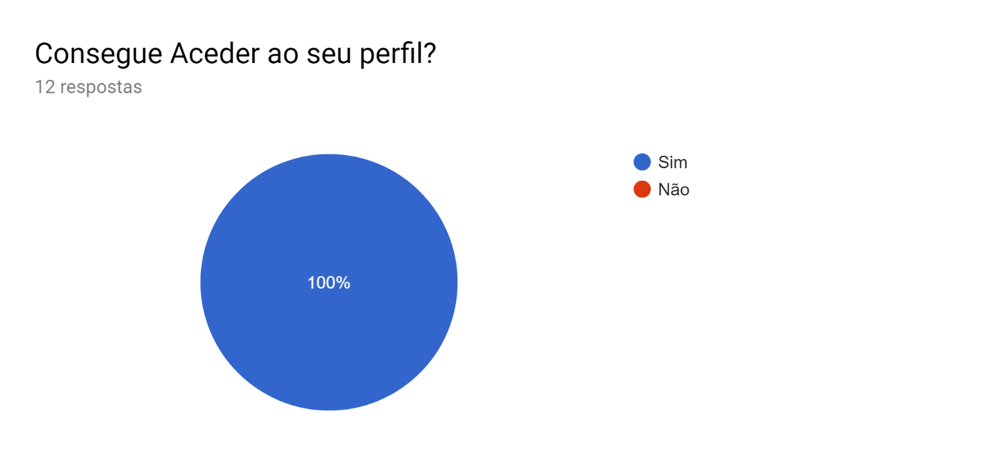

# Albergue
Albergue Animal ESW

Métodos de entrega:  

* Atividades metodológicas (Atividades de Framework): 

* Comunicação 

* Planeamento 

* Modelação 

    * Análise dos requisitos 

    * Design 

* Construção 

    * Código 

    * Testes 

* Deployment 

 
# Objetivo da aplicação:  

## Fases do projeto: 

1 - Fase da análise e especificação de requisitos - Analisámos o documento de MSI  

2 - Fase do desenho de alto nível - detalhar o documento da fase anterior
              
 3 - Fases do desenho detalhado:  

Guião para a apresentação de ESW

**Grupo 03 - ESW05:**

-   Bruno Costa nº150221016

-   Inês Norberto nº150221061

-   Inês Reis nº 150221017

-   João Gomes nº 150221001

## Capa: 

	- Damos a conhecer a equipa e o projeto.** **

## Métodos de entrega:

### Atividades metodológicas (Atividades de Framework):

-   Comunicação

-   Planeamento

-   Modelação

-   Análise dos requisitos

-   Design

-   Construção

-   Código

-   Testes

-   Deployment

**     Objetivo da aplicação: **

### Fases do projeto:

1 - Fase da análise e especificação de requisitos - Analisámos o documento de
MSI

2 - Fase do desenho de alto nível - detalhar o documento da fase anterior

3 - Fases do desenho detalhado:

>   Sprint 1 - Utilizadores:

-   Requisitos Funcionais:

| Módulo            | ID          | Descrição                                                                                                                         | Prioridade  |
|-------------------|-------------|-----------------------------------------------------------------------------------------------------------------------------------|-------------|
| M2 – Utilizadores | **RF2.1**   | O sistema deverá permitir ao responsável do canil efetuar operações CRUD sobre a ficha de um utilizador e funcionário/voluntário. | *Must Have* |
|                   | **RF2.2**   | O sistema deverá permitir ao responsável do canil arquivar a ficha de um funcionário/voluntário.                                  | *Must Have* |
|                   | **RF2.6  ** | O sistema deverá permitir ao responsável do canil realizar as operações CRUD numa conta de utilizador.                            | *Must Have* |
|                   | **RF2.7**   | O sistema deverá permitir aos utilizadores e funcionários/voluntários autenticarem-se no sistema.                                 | *Must Have* |
|                   | **RF2.8**   | O sistema deverá permitir ao responsável do canil associar uma conta de utilizador a uma ficha de funcionário.                    | *Must Have* |

-   Burndown:

    (Não temos burndown para o sprint 1)

-   Tecnologias utilizadas:

    

    \- Google API OAuth 2.0: o protocolo OAuth 2.0 para autenticação e
    autorização.

-   \- SendGrid API: Utilizamos SendGrid como uma plataforma de comunicação
    com o cliente, para email transacional.

**Métodos **- Roles Authorizations( backbone da aplicação)

- Manipulação da Informação (Administrador Gestor de Recursos Humanos )

**Features **:

-   Manipulação do perfil de Utilizador.

Figura 1 -

-   Imagem de Perfil -Todas as imagens da aplicação são guardadas seguramente
    por Bites na base de dados.

Bom para o backup da base de dados.

Figura 2 -

Figura 3 - Gestão de utilizadores

Figura 4 - Lista de utilizadores

Figura 5 - Lista de funcionários

>   Resumo: Sprint em que de inicio apenas Implementamos o IdentiTyUser e a
>   autenticação , no sprint 4 onde nos foi aonselhado melhorar as diversos
>   modulos fizemos acrescentos no modulo de utilizador, mais precisamente, na
>   parte de autorizações e man

>   **- Sprint 2 - Animais: **

-   Requisitos Funcionais:

| Módulo       | ID        | Descrição                                                                                                                       | Prioridade   |
|--------------|-----------|---------------------------------------------------------------------------------------------------------------------------------|--------------|
| M4 - Animais | **RF4.1** | O sistema deverá permitir ao responsável do canil efetuar operações CRUD sobre a ficha de um animal.                            | *Must Have*  |
|              | **RF4.2** | O sistema deverá permitir ao responsável do canil/funcionário aimpressão de uma ficha.                                          | *Must Have*  |
|              | **RF4.3** | O sistema deverá permitir ao responsável docanil/funcionário/voluntário filtrar a lista de fichas com determinadaespecificação. | *MustHave*   |
|              | **RF4.4** | O sistema deverá permitir ao responsável do canil ordenar as fichas dos animais por data de nascimento e por nome.              | *ShouldHave* |
|              | **RF4.5** | O sistema deverá permitir aos utilizadores avaliar os animais.                                                                  | *ShouldHave* |

-   Burndown:

    

-   Tecnologias utilizadas:

    \- Rotativa.AspNetCore: Package para converter HTML para PDF por WkHtmlToPdf
    para ASP.NET Core em aplicativos da Web do Azure (Imprimir Fichas de
    Animais)

**Métodos** - Roles Authorizations (Adminstrador e Gestor de Animais)

- Filtragem Por Datas;

- Imprimir Ficha de Animais;

- Manipulação das informações do modelo de Animais.

**Features:**

Figura 6 – Visualização a partir do Administrador ou Gestor de animais

Figura 7 – Visualização a partir do Utilizador

Figura 8 – Visualização do Animal

>   **- Sprint 3 - Adoções:**

-   Requisitos Funcionais:

| Módulo       | ID        | Descrição                                                                                                                                               | Prioridade  |
|--------------|-----------|---------------------------------------------------------------------------------------------------------------------------------------------------------|-------------|
| M3 – Adoções | **RF3.1** | O sistema deverá permitir ao responsável do canil a realização das operações CRUD sobre uma ficha de saída                                              | Must Have   |
|              | **RF3.2** | O sistema deverá permitir ao responsável do canil juntar anexos a processos arquivados                                                                  | Should Have |
|              | **RF3.3** | O sistema deverá permitir ao responsável do canil/funcionário/voluntário a filtragem de fichas de saída arquivadas, por data e por raça do cão adotado. | Must Have   |
|              | **RF3.4** | O sistema deverá permitir ao responsável do canil/ funcionário filtrar por data de entrada dos animais recém-chegado.                                   | Must Have   |

-   Burndown:

    

    z

-   Tecnologias utilizadas:

    

    \- Rotativa.AspNetCore: Package para converter HTML para PDF por WkHtmlToPdf
    para ASP.NET Core em aplicativos da Web do Azure (Imprimir Fichas de Adoção)

\- SendGrid API: Utilizamos SendGrid como uma plataforma de comunicação com o
cliente, para email transacional (Notificação de Utilizadores quanto ao estado
da aplicação)

**Métodos** - Roles Authorizations( Adminstrador e Gestor de Adoções)

- Imprimir Ficha de Adoção

- Manipulação das informações do modelo de Adoções.

	   - Enviou de Email Transacionais a partir de Template do Sendgrid

**Features:**

Figura 9 – Adoções – Visualização por Administrador

Figura 10– Adoções – Visão por Utilizador (Membro)

Figura 11 – Ficha de Adoção

Figura 12 – Email template

Figura 13 – Adoções – Template SendGrid

>   **- Sprint 4 - Stock**

-   Requisitos Funcionais:

| Módulo     | ID        | Descrição                                                                                                                                                             | Prioridade |
|------------|-----------|-----------------------------------------------------------------------------------------------------------------------------------------------------------------------|------------|
| M1 – Stock | **RF1.1** | O sistema deverá permitir ao responsável do canil a realização das operações CRUD sobre um produto.                                                                   | Must Have  |
|            | **RF1.2** | O sistema deverá permitir ao responsável do canil / funcionário alterar a quantidade de um produto, enviando uma notificação quando um produto está abaixo do limite. | Must Have  |
|            | **RF1.3** | O sistema deverá permitir ao responsável do canil / funcionário registar os produtos necessários no site.                                                             | MustHave   |
|            | **RF1.4** | O sistema deverá permitir ao responsável do canil / funcionário destacar produtos em excesso de quantidade.                                                           | ShouldHave |

-   Burndown:

    

-   Tecnologias utilizadas:

    \- SendGrid API- Utilizamos SendGrid como uma plataforma de comunicação com
    o cliente, para email transacional (Notificação de Gestores de Stock quanto
    ao quantidade Minima de Produto)

**Métodos** - Roles Authorizations( Administrador e Gestor de Stock)

- Manipulação das informações do modelo de Stock.

	   - Enviou de Email Transacionais a partir de Template do Sendgrid(opção)

- Requisitar Produto com Notificação de Quantidade Minima (feature que se
destaca neste modulo)

**Features:**

Figura 14 – Stock de produtos (Gestor de Stock e Administrador)

Figura 15 - Email de notificação de Stock mínimo

**Resumo: **Neste Sprint realizámos todos os requisitos levantados do stock, e
por conselho do nosso cliente fizemos melhorias à aplicação relativamente ao
módulo de Utilizadores, onde começamos a perceber a importância do tratamento
deste (Listas De Utilizadores/Lista de Funcionários) e manipulação do mesmo.

>   **- Sprint 5 - Estatísticas**

-   Requisitos Funcionais:

| Módulo            | ID        | Descrição                                                                              | Prioridade  |
|-------------------|-----------|----------------------------------------------------------------------------------------|-------------|
| M5 – ESTATÍSTICAS | **RF5.1** | Visualizar Métrica de Perfil Completo (Módulo Utilizadores)                            | Must Have   |
|                   | **RF5.2** | Visualizar Métrica de número de animais por Raça (Módulo Animais)                      | Should Have |
|                   | **RF5.3** | Visualizar Métrica de número de adopções por estado de processo (Módulo Adoções)       | Must Have   |
|                   | **RF5.4** | Visualizar Métrica de quantidade de produto por tipo de produto (Módulo Stock)         | Must Have   |
|                   | **RF5.5** | Implementação de métrica consoante o número de visualizações de animal (Módulo Animal) | Must Have   |

-   Burndown:

    

-   Tecnologias utilizadas:

# \- Gráficos JavaScript e mapas Biblioteca de programação para todos os seus necessidades de visualização de dados.

**Features:**

-   Adoções- estatística para saber o estado de todas as adoções não arquivadas
    (Authorization: Administrador e Gestor de Adoções)

    

Figura 16 -

-   Animais-estatística para saber as Raças de todos os Animais não arquivados
    (Adotados) -(Authorization: Administrador e Gestor de Animais)

-   Indiação do numero de vizualizações de Animal

    

Figura 17 -

Figura 18 -

-   Stock-estatística para conhecimento de quantidades de todos os Tipos de
    Produto -(Authorization: Administrador e Gestor de Stock)

Figura 19 -

-   Utizadores - Dashboard para indicação do (Profile Completation)

    

Figura 20 -

-   DashBoard -Visualização do Estado Global da Empresa

    -Utilizadores- Mostra o número de Utilizadores (Membros) que não sejam
    funcionários do site.

    - Animais- Mostra o número de Animais que não estejamarquivados.

    - Adoções- Mostra o número de Adoções que não estejam arquivadas.

    - Stock- Mostra Todos os tipos de Stock

Figura 21 -

**Resumo: **Apesar de ser o de menor duração, foi o que em termos de
desenvolvimento foi mais fácil de implementar, talvez por ter sido aquele que
demostramos graficamente a informação dos requisitos que gerámos nos sprints
anteriores.

**Resumo Final: **

**Métodos** – Roles Authorizations( Engloba todos as Roles Dividido por cargos)

\- **Tabela com os testes realizados:**

-   Testes de browser - verifica se são compatíveis nos browsers (colocados no
    Trello)

-   Testes Automação (desenho detalhado)

-   Testes de aceitação - verifica se as funcionalidades estão de acordo com os
    requisitos (cliente)

-   Testes unitários - verifica que se os métodos testam o que é suposto (na
    fase de testes do sprint por modulo)

-   Testes de integração - garante a ligação entre os módulos (vê se estão
    integrados)

-   Testes de sistema - testa o sistema final da aplicação como um todo

-   Testes de usabilidade - verifica a facilidade que o utilizador tem de
    compreender e manipular o site

    (Ver anexo abaixo)

-   Testes de carga - o limite de dados processados pelo software

(Teste Inconclusivo)

	- Mostrar o diagrama de classes de todos os sprints

	- Mostrar o diagrama de navegabilidade do projeto

Core:

**Mostrar a hierarquia de autorização dos Roles:**

**Nível 1:**

-   Acesso Máximo de informaçao e Autorização

**Nível 2:**

-   Gestor de Recursos Humanos- Irá ter acesso ao modulo de Utilizadores e á
    gestão do mesmo

-   Gestor de Animais- Irá ter acesso ao modulo de Animais e á gestão do mesmo

-   Gestor de Stock- Irá ter acesso ao modulo de Stock e á gestão do mesmo

-   Gestor de Adoções- Irá ter acesso ao modulo de Adoções e á gestão do mesmo

**Nível 3:**

-   Acesso em stand by não tem acesso a nenhuma informção pois está á espera de
    atribuição de  cargo

-   Funcionário

    **Nível 4:**

-   Nivel básico de acesso equiparado a utilizador membro do site poderá ver
    todos os animais sem manipulação, e  poderá efectuar um pedido de adoção

-   Utilizadores (Registados)

**Nível 5:**

-   Nivel mais básico de acesso Visitante comum do site poderá ver todos os
    animais Utilizadores (Não Registados)

    **Resumo:** Componente Core da Aplicação-

    Árvore (figura acima) o backbone da nossa aplicação

    Com este Modelo:

    Flexibilidade: Flexibilidade na estrutura empresarial (A nossa aplicação
    está feita para desconhecer o numero de trabalholhadores e adptar-se ao
    mesmo )

    Entrega De um produto final (entrega de uma productKey(email,password) de um
    super admnistrador e a partir daí o cliente estrutura e manipula o seio da
    empresa)

    Nivel de Acesso Restrito a diversos seore(Roles) da empresa

**Diagrama de classes total:**

>   **Mostrar o vídeo da aplicação**

**Secção:1**

**Pergunta 1:**

**Respostas:**

**Secção:1**

**Pergunta 2:**

**Respostas:**

**Secção:1**

**Pergunta 3:**

**Resposta:**

**Secção 2**

**Pergunta1:**

**Respostas:**

**Secção 2**

**Pergunta 2:**

**Respostas:**

**Secção 3**

**Pergunta 1:**

**Respostas:**

**Secção 3**

**Pergunta 2:**

**Respostas:**

**Secção 4**

**Pergunta 1:**

**Resposta:**

**Secção 5**

**Pergunta 1:**

 
